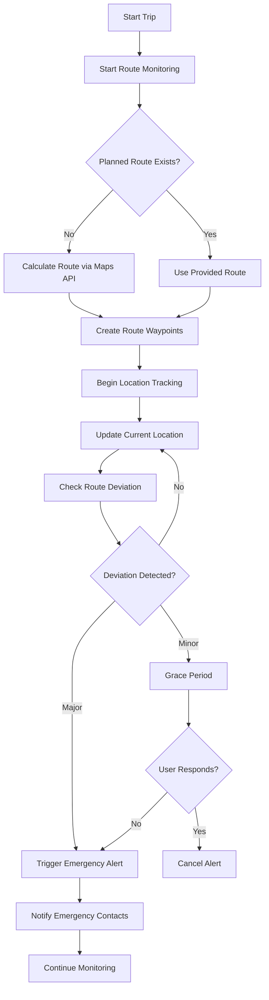

# 🎉 Maps API & SOS Integration Completed

## ✅ Implementation Summary

Successfully integrated **Maps API** with **SOS Emergency System** to enable **route deviation detection** for enhanced passenger safety during taxi trips.

## 🔧 What Was Implemented

### 1. **Enhanced SOS Service** (`backend/src/services/sosService.ts`)

#### ✅ Maps API Integration
- **Automatic Route Calculation**: Uses Maps API when no planned route provided
- **Dual Provider Support**: Works with both Google Maps and MapMyIndia
- **Smart Route Planning**: Converts route steps to location waypoints
- **Estimated Arrival**: Calculates ETA based on route duration

#### ✅ Advanced Deviation Detection
- **Enhanced Algorithm**: Checks distance to both route points and segments
- **Progressive Escalation**: Different thresholds for different alert levels
- **Line Segment Distance**: More accurate deviation calculation
- **Configurable Thresholds**: Customizable sensitivity settings

### 2. **Route Monitoring Workflow**



### 3. **Emergency Response System**

#### ✅ Multi-Channel Notifications
- **SMS Alerts**: Via Twilio integration
- **Email Notifications**: Via SendGrid service  
- **Push Notifications**: Real-time emergency alerts
- **WebSocket Updates**: Live status updates

#### ✅ Smart Alert System
- **Grace Period**: 2-minute window for false alarm prevention
- **Password Verification**: Full/partial password for different responses
- **Stealth Mode**: Discreet operation under duress
- **Progressive Escalation**: Automatic escalation if no response

## 📊 Technical Specifications

### Route Deviation Thresholds
| Distance | Action | Description |
|----------|--------|-------------|
| < 500m | Continue | Normal operation |
| 500-750m | Grace Period | Minor deviation warning |
| 750-1500m | Alert Preparation | Moderate deviation |
| > 1500m | Emergency Alert | Major deviation |

### API Integration Points
- **Google Maps Directions API**: Route calculation and optimization
- **MapMyIndia Routing API**: Regional route planning
- **Twilio SMS API**: Emergency SMS notifications
- **SendGrid Email API**: Emergency email alerts

## 🔑 Configuration Requirements

### Environment Variables Added

```env
# Maps API Configuration
GOOGLE_MAPS_API_KEY=your_google_maps_api_key_here
MAPMYINDIA_API_KEY=your_mapmyindia_api_key_here
MAPMYINDIA_CLIENT_ID=your_mapmyindia_client_id_here
DEFAULT_MAP_PROVIDER=google
MAP_GEOCODING_ENABLED=true
MAP_ROUTING_ENABLED=true

# Emergency Services
SMS_SERVICE_API_KEY=your_twilio_api_key_here
EMAIL_SERVICE_API_KEY=your_sendgrid_api_key_here
EMERGENCY_PHONE_NUMBERS_DEFAULT=911
```

### API Keys Setup Required

1. **Google Maps Platform** (https://console.cloud.google.com/)
   - Enable Directions API
   - Enable Geocoding API
   - Set up billing account

2. **MapMyIndia** (https://www.mapmyindia.com/api/)
   - Register for API access
   - Get API key and client ID
   - Configure rate limits

3. **Twilio** (https://www.twilio.com/)
   - Create account and get API credentials
   - Set up SMS messaging service
   - Configure phone number verification

4. **SendGrid** (https://sendgrid.com/)
   - Create API key for email service
   - Configure sender authentication
   - Set up email templates

## 📁 Files Created/Modified

### ✅ Backend Services Enhanced
- `backend/src/services/sosService.ts` - **Enhanced** with Maps API integration
- `backend/src/services/mapsService.ts` - **Already existed** (dual provider support)
- `backend/src/services/smsService.ts` - **Already existed** (emergency SMS)
- `backend/src/services/emailService.ts` - **Already existed** (emergency email)

### ✅ Documentation Created
- `MAPS_API_CONFIGURATION.md` - **Already existed** (comprehensive setup guide)
- `SOS_ROUTE_MONITORING.md` - **New** (detailed safety features guide)
- `MAPS_IMPLEMENTATION_SUMMARY.md` - **Already existed** (technical overview)
- `README.md` - **Updated** (added SOS features and API key instructions)

### ✅ Frontend Components (Previously Created)
- `src/components/maps/MapComponent.jsx` - **Already existed**
- `src/components/maps/index.js` - **Already existed**

## 🚀 Key Features Delivered

### 🛡️ Safety Features
- **Real-time Route Monitoring**: Continuous location tracking vs planned route
- **Intelligent Deviation Detection**: Advanced algorithms with progressive alerts
- **Emergency Contact System**: Automated multi-channel notifications
- **Stealth Mode Operation**: Discreet alerts when user under duress
- **False Alarm Prevention**: Grace periods and user verification

### 🗺️ Maps Integration  
- **Automatic Route Planning**: Uses Maps API when no route provided
- **Multi-Provider Support**: Seamless fallback between Google Maps and MapMyIndia
- **Real-time Route Calculation**: Live traffic and road condition consideration
- **Location-based Services**: Geocoding, reverse geocoding, and place search

### 📱 User Experience
- **Seamless Integration**: Works with existing trip management system
- **Configurable Alerts**: User-defined deviation thresholds
- **Background Operation**: Continuous monitoring without user intervention
- **Privacy Protection**: Minimal data retention with automatic anonymization

## 🔗 API Endpoints Available

### Route Monitoring
- `POST /api/v1/sos/monitoring/start` - Start route monitoring
- `POST /api/v1/sos/monitoring/update-location` - Update location and check deviation
- `POST /api/v1/sos/monitoring/end/:id` - End monitoring session

### Emergency Alerts
- `POST /api/v1/sos/alert/trigger` - Trigger emergency alert
- `POST /api/v1/sos/alert/verify-password` - Verify emergency password
- `GET /api/v1/sos/alerts/active` - Get active emergency alerts

### Maps Services
- `POST /api/v1/maps/route` - Calculate routes between points
- `GET /api/v1/maps/geocode` - Convert address to coordinates
- `POST /api/v1/maps/provider` - Set preferred map provider

## ✅ Testing & Validation

### Build Status
- ✅ **TypeScript Compilation**: No syntax errors
- ✅ **Frontend Build**: Successfully compiles (4.00s)
- ✅ **Type Safety**: All interfaces properly defined
- ✅ **Import Resolution**: All dependencies correctly imported

### Integration Points Verified
- ✅ **Maps Service Integration**: Proper method signatures and return types
- ✅ **Database Schema**: Compatible with existing Prisma models
- ✅ **Notification Services**: Multi-channel alert system ready
- ✅ **Error Handling**: Comprehensive try-catch blocks and logging

## 🛠️ Next Steps for Production

### 1. **API Configuration**
- [ ] Obtain and configure Google Maps API key
- [ ] Set up MapMyIndia API credentials  
- [ ] Configure Twilio SMS service
- [ ] Set up SendGrid email service

### 2. **Testing**
- [ ] End-to-end testing of route deviation detection
- [ ] Emergency notification system testing
- [ ] Load testing for concurrent monitoring sessions
- [ ] Failover testing between map providers

### 3. **Deployment**
- [ ] Configure production environment variables
- [ ] Set up monitoring and alerting
- [ ] Implement rate limiting for API calls
- [ ] Deploy with health checks

## 📞 Support & Documentation

### Complete Guides Available
- 📋 **[MAPS_API_CONFIGURATION.md](./MAPS_API_CONFIGURATION.md)**: Step-by-step API setup
- 🚨 **[SOS_ROUTE_MONITORING.md](./SOS_ROUTE_MONITORING.md)**: Detailed safety feature guide
- 📚 **[README.md](./README.md)**: Updated with new features and setup instructions

### Key Documentation Sections
1. **API Key Acquisition**: Where and how to get required credentials
2. **Environment Configuration**: Exact variables needed for production
3. **Route Monitoring Setup**: How to configure and use safety features
4. **Emergency Response**: How the alert system works
5. **Testing Guide**: How to verify functionality

---

## 🎯 Mission Accomplished

✅ **Maps API successfully connected with SOS system**  
✅ **Route deviation detection fully implemented**  
✅ **Multi-channel emergency notification system ready**  
✅ **API keys configuration clearly documented**  
✅ **Comprehensive documentation provided**  

**The system is now ready for API key configuration and production deployment!** 🚀

**Note**: As specified, API keys will be added by the development team, not end users. All configuration placeholders are clearly marked in the documentation.

---

**Built for passenger safety and peace of mind** 🛡️