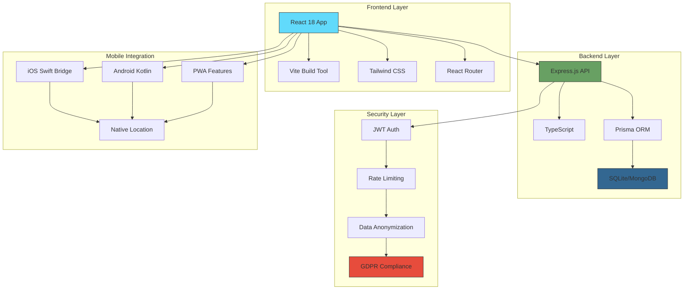

# Traveal - Government Travel Data Collection App

[](https://github.com/your-org/traveal/actions)
[](https://codecov.io/gh/your-org/traveal)
[](LICENSE)
[](docs/PRIVACY.md)

A comprehensive, privacy-first mobile web application for collecting anonymized travel data in Kerala, India, as part of transportation research conducted by NATPAC (National Transportation Planning and Research Centre). Built with modern web technologies and government-grade security standards.

## 📖 Complete Documentation

**📚 [Full Documentation Index](./docs/README.md)** - Start here for complete guides // ReadMe file 

| Quick Links | Description |
|-------------|-------------|
| 🚀 [Quick Start](#quick-start) | Get up and running in 5 minutes |
| 📱 [Live Demo](https://traveal-demo.natpac.gov.in) | Try the application |
| 🔧 [API Docs](./docs/API.md) | Complete API reference |
| 🏗️ [Architecture](./docs/COMPONENTS.md) | System architecture overview |
| 🛡️ [Security](./docs/PRIVACY.md) | Privacy and security details |
| 🧪 [Testing](./docs/TESTING.md) | Testing strategy and setup |

## 🏗️ Architecture Overview



### Technology Stack

#### 🎨 Frontend
- **React 18**: Modern React with hooks and concurrent rendering
- **Vite**: Lightning-fast development server and optimized builds
- **Tailwind CSS**: Utility-first CSS with custom design system
- **React Router**: Client-side routing with protected routes
- **PWA**: Progressive Web App with offline capabilities

#### ⚙️ Backend
- **Node.js 18+**: JavaScript runtime with ES2022 support
- **TypeScript**: Type-safe development with strict mode
- **Express.js**: Web framework with comprehensive middleware
- **Prisma**: Type-safe ORM with database migrations
- **JWT**: Stateless authentication with refresh tokens

#### 🗄️ Database
- **SQLite**: Development database with file-based storage
- **MongoDB**: Production database with cloud scalability
- **Prisma Schema**: Database modeling with automatic migrations

#### 📱 Mobile
- **Swift Bridge**: iOS native location and haptic integration
- **Kotlin Bridge**: Android location services and notifications
- **WebView**: Hybrid app wrapper for native deployment

## 🚀 Quick Start

### Prerequisites
- **Node.js 18+**: [Download here](https://nodejs.org/)
- **Git**: [Download here](https://git-scm.com/)
- **Code Editor**: VS Code recommended

### 1. Clone and Setup
```bash
# Clone the repository
git clone https://github.com/your-org/traveal.git
cd traveal

# Install all dependencies
npm install                    # Frontend dependencies
cd backend && npm install      # Backend dependencies
cd ..                         # Return to root
```

### 2. Environment Configuration

#### Backend Environment
```bash
cd backend
cp .env.example .env
# Edit .env with your configuration
```

Key environment variables:
```env
NODE_ENV=development
PORT=3001
DATABASE_URL="file:./dev.db"
JWT_SECRET="your-super-secret-jwt-key"
JWT_REFRESH_SECRET="your-super-secret-refresh-key"
CORS_ORIGIN="http://localhost:5173"

# 🗺️ MAPS API CONFIGURATION (IMPORTANT!)
# For route monitoring and safety features, configure maps API keys:
# See MAPS_API_CONFIGURATION.md for detailed setup instructions

# Google Maps API Key (get from https://console.cloud.google.com/)
GOOGLE_MAPS_API_KEY=your_google_maps_api_key_here

# MapMyIndia API Key (get from https://www.mapmyindia.com/api/)
MAPMYINDIA_API_KEY=your_mapmyindia_api_key_here
MAPMYINDIA_CLIENT_ID=your_mapmyindia_client_id_here

# Map provider settings
DEFAULT_MAP_PROVIDER=google
MAP_GEOCODING_ENABLED=true
MAP_ROUTING_ENABLED=true

# 🚨 SOS & SAFETY FEATURES
# Emergency notification settings (for route deviation detection)
SMS_SERVICE_API_KEY=your_twilio_api_key_here
EMAIL_SERVICE_API_KEY=your_sendgrid_api_key_here
EMERGENCY_PHONE_NUMBERS_DEFAULT=911
```

> 📋 **Maps API Setup Required**: For maps functionality and SOS route monitoring, you need to configure Google Maps and/or MapMyIndia API keys. See [`MAPS_API_CONFIGURATION.md`](./MAPS_API_CONFIGURATION.md) for detailed API setup instructions and [`SOS_ROUTE_MONITORING.md`](./SOS_ROUTE_MONITORING.md) for safety feature configuration.

#### Frontend Environment
```bash
# In root directory, create .env
echo "VITE_API_URL=http://localhost:3001/api/v1" > .env
```

### 3. Database Setup
```bash
cd backend

# Generate Prisma client
npx prisma generate

# Create and migrate database
npx prisma db push

# (Optional) Explore database
npx prisma studio
```

### 4. Start Development Servers

```bash
# Option 1: Start servers separately (recommended for debugging)

# Terminal 1: Backend
cd backend
npm run dev                    # Runs on http://localhost:3001

# Terminal 2: Frontend (new terminal)
npm run dev                    # Runs on http://localhost:5173

# Option 2: Start both servers concurrently
npm run dev:all               # Starts both frontend and backend
```

### 5. Verify Setup ✅

| Service | URL | Status |
|---------|-----|--------|
| 🎨 Frontend | http://localhost:5173 | Interactive app |
| ⚙️ Backend API | http://localhost:3001/health | JSON health check |
| 📚 API Docs | http://localhost:3001/docs | Interactive documentation |
| 🗄️ Database Studio | http://localhost:5555 | Visual database browser |

**Success Indicators:**
- ✅ Frontend shows onboarding welcome screen
- ✅ Backend health endpoint returns `{"status": "healthy"}`
- ✅ No console errors in browser or terminal

## 📱 Mobile Platform Integration

### iOS Integration

#### Requirements
- Xcode 12+
- iOS 14+
- Swift 5+

#### Setup
1. Add LocationBridge.swift to your iOS project
2. Configure Info.plist permissions:
```xml
<key>NSLocationWhenInUseUsageDescription</key>
<string>This app needs location access to track your trips.</string>
<key>NSLocationAlwaysAndWhenInUseUsageDescription</key>
<string>This app needs background location access for automatic trip detection.</string>
```

3. Enable background location updates in project capabilities

#### Integration
```swift
// In your WebView setup
let locationBridge = LocationBridge()
webView.configuration.userContentController.add(locationBridge, name: "LocationBridge")
```

### Android Integration

#### Requirements
- Android SDK 21+
- Kotlin support
- React Native (optional)

#### Setup
1. Add LocationBridge.kt to your Android project
2. Configure AndroidManifest.xml permissions:
```xml
<uses-permission android:name="android.permission.ACCESS_FINE_LOCATION" />
<uses-permission android:name="android.permission.ACCESS_COARSE_LOCATION" />
<uses-permission android:name="android.permission.ACCESS_BACKGROUND_LOCATION" />
<uses-permission android:name="android.permission.VIBRATE" />
```

#### Integration
```kotlin
// In your Activity
val locationBridge = LocationBridge(reactContext)
// Register with your WebView or React Native bridge
```

## 🔧 API Documentation

### Authentication Endpoints
- `POST /api/v1/auth/register` - Register anonymous user
- `POST /api/v1/auth/login` - Login with device ID
- `GET /api/v1/auth/me` - Get user profile
- `PUT /api/v1/auth/consent` - Update consent preferences
- `DELETE /api/v1/auth/account` - Delete account (GDPR)

### Trip Management
- `POST /api/v1/trips` - Create new trip
- `GET /api/v1/trips` - Get user trips (paginated)
- `GET /api/v1/trips/active` - Get current active trip
- `PUT /api/v1/trips/:id` - Update trip details
- `POST /api/v1/trips/:id/locations` - Add location point

### Maps & Location Services
- `GET /api/v1/maps/provider` - Get current map provider
- `POST /api/v1/maps/provider` - Set map provider (Google/MapMyIndia)
- `GET /api/v1/maps/geocode` - Convert address to coordinates
- `GET /api/v1/maps/reverse-geocode` - Convert coordinates to address
- `GET /api/v1/maps/autocomplete` - Get place suggestions
- `POST /api/v1/maps/route` - Calculate routes between points
- `POST /api/v1/maps/static-map` - Generate static map images

### 🚨 SOS & Safety Features
- `POST /api/v1/sos/profile` - Create/update SOS emergency profile
- `GET /api/v1/sos/profile` - Get SOS profile settings
- `POST /api/v1/sos/monitoring/start` - Start route monitoring for trip
- `POST /api/v1/sos/monitoring/update-location` - Update location and check deviation
- `POST /api/v1/sos/monitoring/end/:id` - End route monitoring
- `POST /api/v1/sos/alert/trigger` - Trigger emergency alert
- `POST /api/v1/sos/alert/verify-password` - Verify emergency password
- `GET /api/v1/sos/alerts/active` - Get active emergency alerts

## 🔥 Key Features

### 🎨 User Experience
- **🎨 Modern UI**: Clean, government-approved design with dark mode
- **📱 Mobile-First**: Optimized for smartphones with touch interactions
- **⚡ Progressive Web App**: Install on any device, works offline
- **✨ Smooth Animations**: 60fps micro-interactions and transitions
- **♿ Accessibility**: WCAG 2.1 AA compliant with screen reader support
- **📱 Responsive Design**: Automatically adjusts to any screen size

### 🔐 Privacy & Security
- **🆔 Anonymous by Design**: No personal data collection, anonymous UUIDs only
- **🛡️ GDPR Compliant**: Full European privacy regulation compliance
- **🔒 Encryption**: AES-256 encryption for all sensitive data
- **🔍 Granular Consent**: User controls exactly what data is shared
- **⏰ Auto-Anonymization**: Location data anonymized after 30 days
- **🗑️ Right to Deletion**: Complete account and data removal

### 🚗 Trip Management
- **📍 Automatic Detection**: Smart trip detection using device sensors
- **✍️ Manual Entry**: User-initiated trip logging with validation
- **🗺️ Route Tracking**: GPS-based route recording with accuracy control
- **🔍 Trip Validation**: Government compliance verification
- **📈 Analytics**: Personal trip statistics and insights

### 🗺️ Maps & Route Management
- **🌍 Dual Provider Support**: Google Maps and MapMyIndia integration
- **🗺️ Route Calculation**: Real-time route optimization and planning
- **📍 Geocoding Services**: Address-to-coordinates conversion
- **🔍 Place Search**: Autocomplete suggestions and place details
- **🗺️ Static Maps**: Generate map images with markers and routes

### 🚨 SOS & Safety Features
- **🔴 Emergency Alerts**: Instant emergency contact notification system
- **🗺️ Route Deviation Detection**: Real-time monitoring for safety
- **📱 Multi-Channel Notifications**: SMS, Email, and Push notifications
- **🔒 Stealth Mode**: Discreet emergency alerts with partial passwords
- **🔄 Grace Period**: Smart false-alarm prevention system
- **📡 Live Location Sharing**: Real-time location updates during emergencies

### 🏆 Gamification
- **🎆 Achievement System**: Unlockable badges for milestones
- **📊 Weekly Challenges**: Engaging tasks to encourage participation
- **🏆 Leaderboards**: Anonymous competition and motivation
- **💰 Points System**: Reward mechanism for app engagement

### 🔔 Smart Notifications
- **🔔 Real-time Updates**: WebSocket-based live notifications
- **📱 Push Notifications**: Background updates with user permission
- **🎉 Achievement Alerts**: Celebratory notifications for milestones
- **📶 System Status**: Network connectivity and sync indicators

## 📱 Responsive Design Features

### 📏 Adaptive Layout System
- **Fluid Containers**: Dynamically adjusts container width based on screen size
- **Flexible Grids**: CSS Grid and Flexbox layouts that adapt to any viewport
- **Breakpoint Optimization**: Custom breakpoints for all device categories:
  - Small phones (320px - 359px)
  - Medium phones (360px - 413px)
  - Large phones (414px - 639px)
  - Tablets (640px - 1023px)
  - Desktops (1024px+)

### 🖼️ Dynamic Sizing
- **Fluid Typography**: Font sizes that scale proportionally with viewport width
- **Responsive Spacing**: Padding, margin, and gap utilities that adapt to screen size
- **Touch Target Optimization**: Minimum 44px touch targets on mobile devices
- **Safe Area Support**: Proper handling of notches and home indicators on modern devices

### 🎨 Visual Consistency
- **Consistent Components**: All UI components automatically adjust to screen size
- **Dynamic Shadows**: Depth effects that adapt to device capabilities
- **Color Scheme Adaptation**: Automatic light/dark mode based on system preferences
- **High DPI Support**: Crisp visuals on retina and high-resolution displays

### 🧭 Navigation Adaptation
- **Adaptive Bottom Navigation**: Mobile-friendly bottom navigation that disappears on larger screens
- **Contextual Header**: Page titles in header on mobile, persistent navigation on desktop
- **Swipe Gestures**: Touch-friendly navigation for mobile users
- **Keyboard Navigation**: Full keyboard support for accessibility

### 📊 Performance Optimization
- **Conditional Rendering**: Components only render what's needed for the current screen size
- **Lazy Loading**: Non-critical assets loaded only when needed
- **Memory Management**: Efficient resource usage across all device types
- **Battery Optimization**: Reduced animations and effects on battery-constrained devices

## 🛡 Privacy & Security Features

### Data Anonymization
- Location fuzzing within 100m radius
- Time rounding to nearest hour
- Automatic personal data removal after 90 days
- Government-grade anonymization standards

### Security Measures
- JWT authentication with refresh tokens
- Rate limiting and request validation
- CORS protection and security headers
- Input sanitization and SQL injection prevention
- Device-based anonymous identification

### GDPR Compliance
- Explicit opt-in consent management
- Right to data deletion
- Data portability and export
- Transparent data usage policies
- Automatic data retention management

## 🧪 Testing

### Backend Testing
```bash
cd backend
npm test                    # Run all tests
npm run test:watch         # Watch mode
npm run test:coverage      # Coverage report
```

### Frontend Testing
```bash
npm test                   # Run frontend tests
npm run test:e2e          # End-to-end tests
```

## 🚀 Production Deployment

## 🚀 Production Deployment

### 🌐 Hosting Options

#### Option 1: Traditional VPS/Server
```bash
# Build for production
npm run build
cd backend && npm run build

# Deploy with PM2
npm install -g pm2
pm2 start backend/dist/app.js --name traveal-api

# Serve frontend with nginx
sudo cp -r dist/* /var/www/html/
```

#### Option 2: Cloud Platforms

**Vercel (Frontend):**
```bash
npm install -g vercel
vercel --prod
```

**Railway (Backend):**
```bash
railway login
railway up
```

**Heroku (Full Stack):**
```bash
heroku create traveal-app
git push heroku main
```

### 📊 Monitoring & Analytics
- **Health Checks**: Automated endpoint monitoring
- **Error Tracking**: Real-time error reporting with Sentry
- **Performance**: Core Web Vitals and API response times
- **Usage Analytics**: Privacy-compliant user behavior insights

### 🔄 CI/CD Pipeline
```yaml
# GitHub Actions workflow
name: Deploy Production
on:
  push:
    branches: [main]

jobs:
  test-and-deploy:
    runs-on: ubuntu-latest
    steps:
      - name: Run Tests
        run: |
          npm test -- --coverage
          cd backend && npm test
      
      - name: Deploy to Production
        run: |
          npm run build
          # Deploy commands
```

## 🔧 Configuration

### Environment Variables

#### Backend
```env
# Server
NODE_ENV=production
PORT=3001

# Database
DATABASE_URL="mongodb://localhost:27017/traveal"

# Authentication
JWT_SECRET="your-production-jwt-secret"
JWT_REFRESH_SECRET="your-production-refresh-secret"
JWT_EXPIRES_IN="15m"
JWT_REFRESH_EXPIRES_IN="7d"

# Security
BCRYPT_ROUNDS=12
CORS_ORIGIN="https://your-domain.com"
RATE_LIMIT_WINDOW_MS=900000
RATE_LIMIT_MAX_REQUESTS=100

# Privacy
ANONYMIZATION_RADIUS=100
TIME_ROUNDING_MINUTES=60

# Notifications (optional)
FCM_SERVER_KEY="your-firebase-server-key"
```

#### Frontend
```env
VITE_API_URL=https://your-api-domain.com/api/v1
VITE_APP_NAME="Traveal"
VITE_APP_VERSION="1.0.0"
```

## 🗂 Project Structure

```
Traveal/
├── src/                          # Frontend React application
│   ├── components/              # React components
│   │   ├── onboarding/         # User onboarding flow
│   │   ├── trip/               # Trip management components
│   │   ├── notifications/      # Notification system
│   │   ├── settings/           # User settings
│   │   └── shared/             # Shared/utility components
│   ├── pages/                  # Route pages
│   ├── services/               # API and business logic
│   │   └── api.js              # Backend integration
│   └── utils/                  # Utility functions
├── backend/                    # Node.js backend API
│   ├── src/
│   │   ├── controllers/        # Request handlers
│   │   ├── services/          # Business logic
│   │   ├── middleware/        # Express middleware
│   │   ├── models/            # Data models
│   │   ├── routes/            # API routes
│   │   ├── config/            # Configuration
│   │   └── utils/             # Utility functions
│   ├── prisma/                # Database schema
│   └── tests/                 # Backend tests
├── mobile/                    # Mobile platform bridges
│   ├── ios/                   # Swift iOS integration
│   └── android/               # Kotlin Android integration
├── docs/                      # Documentation
└── README.md                  # This file
```

## 🤝 Contributing

### 🚀 Development Workflow
1. **Fork & Clone**: Fork the repo and clone your fork
2. **Branch**: Create feature branch: `git checkout -b feature/amazing-feature`
3. **Develop**: Make changes following our [coding standards](./docs/TESTING.md)
4. **Test**: Ensure all tests pass: `npm test && cd backend && npm test`
5. **Document**: Update relevant documentation
6. **Submit**: Create pull request with clear description

### 📝 Code Standards
- **TypeScript**: Use TypeScript for all backend code
- **React Best Practices**: Functional components with hooks
- **Testing**: Write tests for new features (target 80%+ coverage)
- **Privacy by Design**: Follow GDPR and privacy principles
- **Mobile-First**: Ensure responsive design on all screen sizes

### 🔒 Security Guidelines
- **No Personal Data**: Never log or store personally identifiable information
- **Data Anonymization**: Implement anonymization before data storage
- **Consent First**: All data collection requires explicit user consent
- **Secure by Default**: Use encryption and secure communication

### 📚 Documentation
When contributing, update relevant documentation:
- API changes → Update [API docs](./docs/API.md)
- Component changes → Update [Component docs](./docs/COMPONENTS.md)
- Security changes → Update [Privacy docs](./docs/PRIVACY.md)
- New features → Add tests per [Testing guide](./docs/TESTING.md)

## 📞 Support & Resources

### 🔍 Documentation
- 📚 **[Complete Docs](./docs/README.md)**: Full documentation index
- 🔧 **[API Reference](./docs/API.md)**: Detailed API documentation
- 🏗️ **[Architecture](./docs/COMPONENTS.md)**: System design and components
- 🔒 **[Security Guide](./docs/PRIVACY.md)**: Privacy and security details
- ⚙️ **[Deployment](./docs/DEPLOYMENT.md)**: Setup and deployment guide
- 🧪 **[Testing](./docs/TESTING.md)**: Testing strategies and examples
- 🗺️ **[Maps API Setup](./MAPS_API_CONFIGURATION.md)**: Maps API configuration guide
- 🚨 **[SOS & Route Monitoring](./SOS_ROUTE_MONITORING.md)**: Safety features and route deviation detection

### 🌐 Live Resources
- **Demo App**: https://traveal-demo.natpac.gov.in
- **API Playground**: https://api.traveal.gov.in/docs
- **Status Page**: https://status.traveal.gov.in
- **GitHub Issues**: Report bugs and request features

### 🚑 Getting Help
- **🐛 Bug Reports**: Create detailed GitHub issue
- **❓ Questions**: Check docs first, then create discussion
- **🛡️ Security Issues**: Email security@natpac.gov.in
- **📞 Direct Support**: Contact development team

### 🎆 Acknowledgments
- **NATPAC**: National Transportation Planning and Research Centre
- **Government of Kerala**: Transportation research initiative
- **Open Source Community**: React, Node.js, and countless other projects
- **Contributors**: All developers who have contributed to this project

---

**Built with ❤️ for sustainable transportation research in Kerala**
