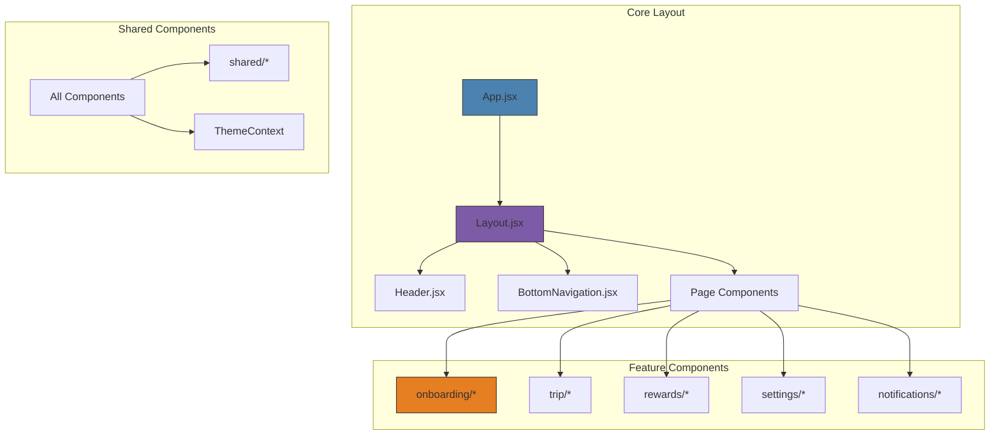

# Frontend Components Documentation

## Overview

The Traveal frontend is built with React 18 and follows a component-based architecture with clear separation of concerns. Components are organized by feature and functionality, with shared components providing consistent UI patterns across the application.

## Project Structure

```
src/
├── components/              # Reusable UI components
│   ├── gems/               # Hidden gems and recommendations
│   ├── notifications/      # Notification system
│   ├── onboarding/         # User onboarding flow
│   ├── rewards/            # Gamification and rewards
│   ├── settings/           # User preferences and privacy
│   ├── shared/             # Shared utility components
│   ├── trip/               # Trip management
│   ├── BottomNavigation.jsx
│   ├── Header.jsx
│   └── Layout.jsx
├── contexts/               # React context providers
├── pages/                  # Route-level page components
├── services/               # API integration
├── utils/                  # Utility functions
└── App.jsx                 # Main application component
```

## Component Architecture



## Core Components

### App.jsx
The root application component that manages global state and routing.

**Key Features:**
- **Onboarding State Management**: Checks localStorage for onboarding completion
- **Route Protection**: Conditionally renders onboarding or main app
- **Loading States**: Displays loading spinner during app initialization
- **Global Error Handling**: Wraps app in error boundaries

**Props:** None

**State:**
```javascript
const [isOnboarded, setIsOnboarded] = useState(false)
const [isLoading, setIsLoading] = useState(true)
```

**Usage:**
```jsx
// Main entry point - renders based on onboarding status
return isLoading ? (
  <LoadingSpinner />
) : !isOnboarded ? (
  <OnboardingFlow onComplete={handleOnboardingComplete} />
) : (
  <Router>
    <Layout>
      <Routes>
        {/* Application routes */}
      </Routes>
    </Layout>
  </Router>
);
```

### Layout.jsx
Provides consistent layout structure across all pages with conditional navigation.

**Key Features:**
- **Conditional Navigation**: Shows Header or BottomNavigation based on route
- **Responsive Structure**: Flexbox layout with mobile-first design
- **Route-aware Rendering**: Adapts to different page contexts

**Props:**
- `children` (ReactNode): Page content to render

**Navigation Logic:**
```javascript
const showBottomNav = [
  '/dashboard', '/trip', '/data', '/rewards', '/profile', '/settings'
].some(path => location.pathname.startsWith(path));
```

**Usage:**
```jsx
<Layout>
  <YourPageComponent />
</Layout>
```

### Header.jsx
Sticky header with branding and contextual navigation.

**Key Features:**
- **Conditional Back Button**: Appears on non-home pages
- **NATPAC Branding**: Government logo and application identification
- **Sticky Positioning**: Remains visible during scroll
- **Accessibility**: Proper ARIA labels and focus management

**Props:** None

**Navigation:**
```javascript
const showBackButton = location.pathname !== '/';
const navigate = useNavigate();

const handleBack = () => {
  navigate(-1); // Browser back navigation
};
```

### BottomNavigation.jsx
Mobile-optimized bottom navigation for main app sections.

**Key Features:**
- **Icon-based Navigation**: Lucide React icons with labels
- **Active State Indication**: Visual feedback for current page
- **Touch-optimized**: Large tap targets for mobile use
- **Accessibility**: Screen reader support and keyboard navigation

**Navigation Items:**
- Dashboard (Home icon)
- Trips (MapPin icon)
- Data (BarChart icon)
- Rewards (Award icon)
- Profile (User icon)

## Onboarding Components

### OnboardingFlow.jsx
Orchestrates the multi-step onboarding process.

**Key Features:**
- **Step Management**: Controls current step and navigation
- **State Management**: Collects and validates consent data
- **Progress Tracking**: Visual progress indication
- **Data Persistence**: Saves consent data to localStorage

**Props:**
- `onComplete` (function): Callback when onboarding finishes

**State:**
```javascript
const [currentStep, setCurrentStep] = useState(0);
const [consentData, setConsentData] = useState({
  locationData: { allowTracking: false, preciseLocation: false },
  sensorData: { motionSensors: false, activityDetection: false },
  usageAnalytics: { anonymousStats: false, crashReports: false }
});
```

**Steps Configuration:**
```javascript
const STEPS = [
  { component: WelcomeStep, title: 'Welcome' },
  { component: PrivacyConsentStep, title: 'Privacy & Consent' },
  { component: SetupCompleteStep, title: 'Setup Complete' }
];
```

### WelcomeStep.jsx
Initial introduction to the application and its purpose.

**Key Features:**
- **App Introduction**: Explains purpose and benefits
- **Government Context**: NATPAC branding and research context
- **Engagement**: Encouraging call-to-action
- **Accessibility**: Clear heading structure and descriptions

**Props:**
- `onNext` (function): Proceed to next step
- `onBack` (function): Return to previous step

### PrivacyConsentStep.jsx
Granular privacy permission selection interface.

**Key Features:**
- **Consent Categories**: Location, sensor, and analytics permissions
- **Toggle Controls**: Interactive on/off switches
- **Information Modals**: Detailed explanations for each permission
- **Real-time Validation**: Updates consent state immediately

**Props:**
- `consentData` (object): Current consent selections
- `onConsentChange` (function): Update consent data
- `onNext` (function): Proceed to next step
- `onBack` (function): Return to previous step

**Consent Structure:**
```javascript
{
  locationData: {
    allowTracking: boolean,
    preciseLocation: boolean
  },
  sensorData: {
    motionSensors: boolean,
    activityDetection: boolean
  },
  usageAnalytics: {
    anonymousStats: boolean,
    crashReports: boolean
  }
}
```

### SetupCompleteStep.jsx
Completion confirmation with granted permissions summary.

**Key Features:**
- **Success Confirmation**: Visual completion feedback
- **Permission Summary**: Display of granted permissions
- **Action Button**: Entry point to main application
- **Celebration**: Positive user experience completion

**Props:**
- `consentData` (object): Final consent selections
- `onComplete` (function): Finish onboarding process

### ProgressBar.jsx
Visual progress indicator for onboarding steps.

**Key Features:**
- **Step Visualization**: Numbered step indicators
- **Progress Animation**: Smooth transitions between steps
- **Completion States**: Visual feedback for completed steps
- **Responsive Design**: Adapts to different screen sizes

**Props:**
- `currentStep` (number): Active step index
- `totalSteps` (number): Total number of steps

## Trip Components

### TripManager.jsx
Central trip management interface with active trip controls.

**Key Features:**
- **Active Trip Display**: Current trip information and controls
- **Quick Actions**: Start, pause, end trip functionality
- **Trip History**: Recent trips overview
- **Status Indicators**: Visual feedback for trip states

### TripHistory.jsx
Historical trip data display with filtering and search.

**Key Features:**
- **Trip List**: Chronological trip display
- **Filtering**: By date, mode, purpose
- **Search**: Text search across trip data
- **Pagination**: Efficient loading of large datasets

### ActiveTrip.jsx
Real-time active trip monitoring and controls.

**Key Features:**
- **Live Updates**: Real-time trip progress
- **Route Visualization**: Map integration for route display
- **Duration Tracking**: Live timer and distance calculation
- **End Trip Controls**: Completion workflow

### ManualTripEntry.jsx
Form for manually entering trip information.

**Key Features:**
- **Trip Details Form**: Start/end locations, mode, purpose
- **Validation**: Input validation and error handling
- **Location Autocomplete**: Address suggestions
- **Save Functionality**: Trip creation and storage

## Notification Components

### NotificationCenter.jsx
Central hub for all user notifications.

**Key Features:**
- **Notification List**: All notifications with filtering
- **Read Status**: Mark as read/unread functionality
- **Categories**: Trip validation, achievements, system
- **Actions**: Notification-specific action buttons

### NotificationProvider.jsx
Context provider for global notification state.

**Key Features:**
- **Global State**: Shared notification state
- **Real-time Updates**: WebSocket integration
- **Queue Management**: Notification display queue
- **Persistence**: LocalStorage integration

### PushNotificationComponent.jsx
Browser push notification integration.

**Key Features:**
- **Permission Request**: User consent for push notifications
- **Service Worker**: Background notification handling
- **Message Handling**: Incoming notification processing
- **Fallback**: In-app notifications when push unavailable

## Rewards Components

### RewardsDashboard.jsx
Main rewards and achievements overview.

**Key Features:**
- **Points Display**: Current user points and level
- **Recent Achievements**: Latest unlocked achievements
- **Progress Tracking**: Goals and milestone progress
- **Leaderboard Preview**: Social comparison elements

### AchievementModal.jsx
Achievement unlock celebration modal.

**Key Features:**
- **Celebration Animation**: Engaging unlock animation
- **Achievement Details**: Description and requirements
- **Sharing Options**: Social sharing functionality
- **Close Actions**: Return to app workflow

### WeeklyChallenges.jsx
Gamification through weekly challenges.

**Key Features:**
- **Challenge List**: Current week's available challenges
- **Progress Tracking**: Completion status and progress
- **Rewards Preview**: Points and badges for completion
- **Timer Display**: Time remaining for challenges

## Settings Components

### SettingsMenu.jsx
Main settings navigation and preferences.

**Key Features:**
- **Settings Categories**: Organized preference sections
- **Quick Toggles**: Common setting switches
- **Navigation**: Deep links to specific settings
- **User Profile**: Account information display

### PrivacyCenter.jsx
Comprehensive privacy control interface.

**Key Features:**
- **Consent Management**: Update privacy preferences
- **Data Control**: Export and deletion options
- **Transparency**: Clear privacy policy links
- **Audit Trail**: History of privacy changes

### AccountSettings.jsx
User account management and preferences.

**Key Features:**
- **Profile Management**: User information updates
- **Security Settings**: Password and authentication
- **Notification Preferences**: Communication controls
- **Account Actions**: Deactivation and deletion

## Shared Components

### ThemeToggle.jsx
Dark/light mode toggle with system preference detection.

**Key Features:**
- **Theme Switching**: Manual theme selection
- **System Integration**: Respects OS theme preference
- **Persistence**: Saves theme choice to localStorage
- **Animation**: Smooth theme transitions

### HelpSystem.jsx
Contextual help and support integration.

**Key Features:**
- **Context-aware Help**: Page-specific assistance
- **Search Functionality**: Help content search
- **Contact Options**: Support channel integration
- **Tutorial Mode**: Interactive app tutorials

### AccessibilityProvider.jsx
Accessibility enhancements and utilities.

**Key Features:**
- **Focus Management**: Keyboard navigation enhancement
- **Screen Reader Support**: ARIA label management
- **High Contrast**: Accessibility display options
- **Text Size**: Dynamic font size adjustment

## Styling and Theming

### Design System
- **Color Palette**: Government-appropriate colors with accessibility compliance
- **Typography**: Clear hierarchy with responsive font scaling
- **Spacing**: Consistent 4px grid system
- **Components**: Reusable styled components

### Responsive Design
- **Mobile-first**: Primary focus on mobile experience
- **Breakpoints**: Standard Tailwind CSS breakpoints
- **Touch Targets**: Minimum 44px for touch interactions
- **Safe Areas**: iOS notch and home indicator support

### Dark Mode Support
- **System Detection**: Automatic theme based on OS preference
- **Manual Override**: User choice persistence
- **Color Adaptation**: All components support both themes
- **Smooth Transitions**: Animated theme switching

## State Management

### Local State
- **useState**: Component-level state management
- **useEffect**: Side effects and lifecycle management
- **useRef**: DOM references and mutable values

### Context Providers
- **ThemeContext**: Global theme state
- **NotificationContext**: Notification queue and state
- **AccessibilityContext**: Accessibility preferences

### External State
- **localStorage**: Persistent user preferences
- **API Integration**: Server state synchronization
- **WebSocket**: Real-time updates

## Performance Optimization

### Code Splitting
- **Route-based**: Lazy loading of page components
- **Feature-based**: Conditional loading of large features
- **Bundle Analysis**: Regular bundle size monitoring

### Memory Management
- **Effect Cleanup**: Proper useEffect cleanup
- **Event Listeners**: Removal on component unmount
- **WebSocket Management**: Connection lifecycle handling

### Rendering Optimization
- **React.memo**: Prevent unnecessary re-renders
- **useMemo**: Expensive calculation memoization
- **useCallback**: Function reference stability

## Testing Strategies

### Component Testing
- **React Testing Library**: Component behavior testing
- **Jest**: Unit testing framework
- **User Interaction**: Event simulation and testing

### Integration Testing
- **API Mocking**: Mock service worker integration
- **Route Testing**: Navigation and routing tests
- **Context Testing**: Provider state testing

### Accessibility Testing
- **axe-core**: Automated accessibility testing
- **Screen Reader**: Manual testing with assistive technology
- **Keyboard Navigation**: Tab order and focus testing

## Development Guidelines

### Component Creation
1. **Function Components**: Use functional components with hooks
2. **PropTypes**: Define prop validation (TypeScript recommended)
3. **Default Props**: Provide sensible defaults
4. **Documentation**: Document complex components

### Code Style
- **ESLint**: Enforced code style and best practices
- **Prettier**: Consistent code formatting
- **Naming**: Clear, descriptive component and prop names
- **File Organization**: Consistent file and folder structure

### Performance Best Practices
- **Avoid Inline Objects**: Prevent unnecessary re-renders
- **Optimize Images**: Use appropriate formats and sizes
- **Lazy Loading**: Implement for non-critical components
- **Bundle Optimization**: Regular analysis and cleanup

For more information, see:
- [API Documentation](./API.md) for backend integration
- [Testing Guide](./TESTING.md) for testing strategies
- [Deployment Guide](./DEPLOYMENT.md) for production deployment