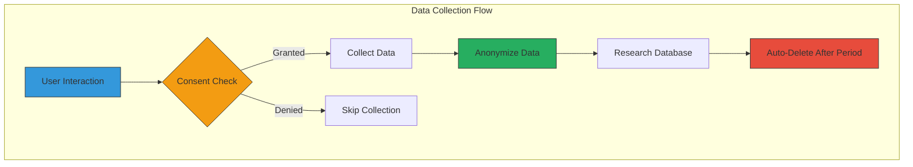

# Privacy and Security Documentation

## Overview

The Traveal application implements comprehensive privacy protection and security measures in compliance with government standards and GDPR requirements. This document outlines all privacy features, security implementations, and compliance measures.

## Privacy-by-Design Principles

### Core Privacy Features
1. **Anonymous User Identification**: Users identified by anonymous UUIDs, not personal information
2. **Explicit Consent**: Granular consent management for all data collection
3. **Data Minimization**: Collect only necessary data for transportation research
4. **Purpose Limitation**: Data used exclusively for stated research purposes
5. **Automatic Anonymization**: Personal identifiers removed after retention period
6. **User Control**: Complete control over data sharing and retention

### Data Collection Transparency


## GDPR Compliance

### Rights Implementation

#### Right to Information
- **Transparent Privacy Policy**: Clear explanation of data collection
- **Purpose Specification**: Detailed description of research goals
- **Data Categories**: Explicit listing of collected data types
- **Retention Periods**: Clear timeframes for data storage

#### Right of Access
```javascript
// API endpoint for data access
GET /api/v1/auth/me
{
  "user": {
    "id": "user_123",
    "uuid": "anon_456",
    "consentData": { /* user consent settings */ },
    "dataCollected": {
      "trips": 25,
      "locationPoints": 1250,
      "analyticsEvents": 89
    }
  }
}
```

#### Right to Rectification
- **Consent Updates**: Real-time consent preference modification
- **Data Correction**: Ability to correct inaccurate trip data
- **Preference Changes**: Update notification and privacy settings

#### Right to Erasure (Right to be Forgotten)
```javascript
// Complete account deletion
DELETE /api/v1/auth/account
{
  "success": true,
  "message": "Account and all associated data deleted",
  "deletedData": {
    "user": true,
    "trips": 25,
    "locationPoints": 1250,
    "notifications": 15,
    "analyticsEvents": 89
  }
}
```

#### Right to Data Portability
```javascript
// Data export functionality
GET /api/v1/analytics/export
{
  "exportUrl": "https://api.traveal.gov/exports/user_123.json",
  "format": "json",
  "anonymized": true,
  "expiresAt": "2024-01-16T10:30:00.000Z"
}
```

### Consent Management

#### Granular Consent Categories
```typescript
interface ConsentData {
  locationData: {
    allowTracking: boolean;        // Basic location collection
    preciseLocation: boolean;      // High-accuracy GPS data
  };
  sensorData: {
    motionSensors: boolean;       // Accelerometer/gyroscope
    activityDetection: boolean;   // Transportation mode detection
  };
  usageAnalytics: {
    anonymousStats: boolean;      // App usage statistics
    crashReports: boolean;        // Error reporting
  };
}
```

#### Consent Validation
```javascript
// Consent validation middleware
const validateConsent = (req, res, next) => {
  const { user } = req;
  const requiredConsent = getRequiredConsentForAction(req.path);
  
  if (!hasValidConsent(user.consentData, requiredConsent)) {
    return res.status(403).json({
      error: 'Insufficient consent for this action',
      requiredConsent
    });
  }
  
  next();
};
```

### Data Anonymization

#### Location Data Anonymization
```javascript
class AnonymizationService {
  static anonymizeLocation(lat, lng, radius = 100) {
    // Add random noise within specified radius
    const randomAngle = Math.random() * 2 * Math.PI;
    const randomRadius = Math.random() * radius;
    
    const deltaLat = (randomRadius * Math.cos(randomAngle)) / 111000;
    const deltaLng = (randomRadius * Math.sin(randomAngle)) / (111000 * Math.cos(lat * Math.PI / 180));
    
    return {
      latitude: lat + deltaLat,
      longitude: lng + deltaLng
    };
  }

  static anonymizeTimestamp(timestamp, roundingMinutes = 60) {
    const date = new Date(timestamp);
    const minutes = date.getMinutes();
    const roundedMinutes = Math.round(minutes / roundingMinutes) * roundingMinutes;
    
    date.setMinutes(roundedMinutes, 0, 0);
    return date;
  }
}
```

#### Automatic Data Anonymization
```javascript
// Scheduled anonymization job
const anonymizeOldData = async () => {
  const cutoffDate = new Date();
  cutoffDate.setDate(cutoffDate.getDate() - 30);
  
  // Anonymize location points older than 30 days
  const oldLocationPoints = await prisma.locationPoint.findMany({
    where: { createdAt: { lt: cutoffDate } }
  });
  
  for (const point of oldLocationPoints) {
    const anonymized = AnonymizationService.anonymizeLocation(
      point.latitude,
      point.longitude
    );
    
    await prisma.locationPoint.update({
      where: { id: point.id },
      data: {
        latitude: anonymized.latitude,
        longitude: anonymized.longitude,
        anonymized: true
      }
    });
  }
};

// Run daily at 2 AM
cron.schedule('0 2 * * *', anonymizeOldData);
```

## Security Implementation

### Authentication Security

#### JWT Token Security
```javascript
const tokenConfig = {
  secret: process.env.JWT_SECRET, // 256-bit minimum
  expiresIn: '15m',              // Short-lived access tokens
  algorithm: 'HS256',            // HMAC SHA-256
  issuer: 'traveal-api',
  audience: 'traveal-app'
};

const refreshTokenConfig = {
  secret: process.env.JWT_REFRESH_SECRET,
  expiresIn: '7d',
  algorithm: 'HS256'
};
```

#### Token Rotation
```javascript
const refreshToken = async (refreshToken) => {
  try {
    const decoded = jwt.verify(refreshToken, JWT_REFRESH_SECRET);
    
    // Generate new access token
    const newAccessToken = generateAccessToken(decoded.userId);
    
    // Generate new refresh token (rotation)
    const newRefreshToken = generateRefreshToken(decoded.userId);
    
    // Invalidate old refresh token
    await prisma.refreshToken.update({
      where: { token: refreshToken },
      data: { revoked: true }
    });
    
    return { accessToken: newAccessToken, refreshToken: newRefreshToken };
  } catch (error) {
    throw new Error('Invalid refresh token');
  }
};
```

### API Security

#### Rate Limiting
```javascript
const rateLimitConfig = {
  windowMs: 15 * 60 * 1000,      // 15 minutes
  max: 100,                      // 100 requests per window
  message: 'Too many requests',
  standardHeaders: true,
  legacyHeaders: false,
  keyGenerator: (req) => {
    return req.ip + ':' + req.headers['x-device-id'];
  }
};

// Stricter limits for auth endpoints
const authRateLimit = rateLimit({
  windowMs: 15 * 60 * 1000,
  max: 5,
  message: 'Too many authentication attempts'
});
```

#### Input Validation
```javascript
const tripValidationSchema = Joi.object({
  startLocation: Joi.object({
    latitude: Joi.number().min(-90).max(90).required(),
    longitude: Joi.number().min(-180).max(180).required(),
    address: Joi.string().max(255).optional()
  }).required(),
  mode: Joi.string().valid('walking', 'driving', 'public_transport', 'cycling'),
  purpose: Joi.string().valid('work', 'school', 'shopping', 'other'),
  companions: Joi.number().integer().min(0).max(10)
});
```

#### SQL Injection Prevention
```javascript
// Using Prisma ORM for type-safe queries
const getUserTrips = async (userId, filters) => {
  return await prisma.trip.findMany({
    where: {
      userId: userId,              // Parameterized query
      mode: filters.mode,          // Type-safe filtering
      createdAt: {
        gte: filters.startDate,
        lte: filters.endDate
      }
    },
    orderBy: { createdAt: 'desc' }
  });
};
```

### Transport Security

#### HTTPS Enforcement
```javascript
// Force HTTPS in production
app.use((req, res, next) => {
  if (process.env.NODE_ENV === 'production' && !req.secure) {
    return res.redirect(301, `https://${req.headers.host}${req.url}`);
  }
  next();
});

// Security headers
app.use(helmet({
  contentSecurityPolicy: {
    directives: {
      defaultSrc: ["'self'"],
      styleSrc: ["'self'", "'unsafe-inline'"],
      scriptSrc: ["'self'"],
      imgSrc: ["'self'", "data:", "https:"]
    }
  },
  hsts: {
    maxAge: 31536000,
    includeSubDomains: true,
    preload: true
  }
}));
```

#### CORS Configuration
```javascript
const corsOptions = {
  origin: (origin, callback) => {
    const allowedOrigins = [
      'https://traveal.natpac.gov.in',
      'https://app.traveal.gov'
    ];
    
    if (!origin || allowedOrigins.includes(origin)) {
      callback(null, true);
    } else {
      callback(new Error('Not allowed by CORS'));
    }
  },
  credentials: true,
  optionsSuccessStatus: 200
};
```

### Data Security

#### Encryption at Rest
```javascript
const encryptSensitiveData = (data) => {
  const algorithm = 'aes-256-gcm';
  const key = crypto.scryptSync(process.env.ENCRYPTION_KEY, 'salt', 32);
  const iv = crypto.randomBytes(16);
  
  const cipher = crypto.createCipher(algorithm, key, iv);
  let encrypted = cipher.update(JSON.stringify(data), 'utf8', 'hex');
  encrypted += cipher.final('hex');
  
  const authTag = cipher.getAuthTag();
  
  return {
    encrypted,
    iv: iv.toString('hex'),
    authTag: authTag.toString('hex')
  };
};
```

#### Database Security
```javascript
// Database connection with SSL
const databaseConfig = {
  provider: 'mongodb',
  url: process.env.DATABASE_URL,
  ssl: {
    rejectUnauthorized: true,
    ca: fs.readFileSync('./certs/ca-certificate.crt'),
    key: fs.readFileSync('./certs/client-key.key'),
    cert: fs.readFileSync('./certs/client-certificate.crt')
  }
};
```

## Privacy Controls

### User Privacy Dashboard
```jsx
const PrivacyCenter = () => {
  const [consentData, setConsentData] = useState({});
  const [dataExport, setDataExport] = useState(null);

  const updateConsent = async (category, setting, value) => {
    const updated = {
      ...consentData,
      [category]: { ...consentData[category], [setting]: value }
    };
    
    await api.put('/auth/consent', { consentData: updated });
    setConsentData(updated);
  };

  const requestDataExport = async () => {
    const response = await api.get('/analytics/export');
    setDataExport(response.data);
  };

  const deleteAccount = async () => {
    if (confirm('Delete all data permanently?')) {
      await api.delete('/auth/account');
      localStorage.clear();
      window.location.href = '/';
    }
  };

  return (
    <div className="privacy-center">
      <ConsentControls 
        consentData={consentData}
        onUpdate={updateConsent}
      />
      <DataExportSection 
        onExport={requestDataExport}
        exportData={dataExport}
      />
      <AccountDeletion onDelete={deleteAccount} />
    </div>
  );
};
```

### Data Retention Policy
```javascript
const RETENTION_POLICIES = {
  locationPoints: 30,        // Days before anonymization
  tripDetails: 90,          // Days before detailed data removal
  analyticsEvents: 365,     // Days before event anonymization
  notifications: 30,        // Days before notification cleanup
  userPreferences: null     // Retained until account deletion
};

const enforceRetentionPolicy = async () => {
  for (const [dataType, retentionDays] of Object.entries(RETENTION_POLICIES)) {
    if (retentionDays === null) continue;
    
    const cutoffDate = new Date();
    cutoffDate.setDate(cutoffDate.getDate() - retentionDays);
    
    switch (dataType) {
      case 'locationPoints':
        await anonymizeLocationPoints(cutoffDate);
        break;
      case 'tripDetails':
        await anonymizeTripDetails(cutoffDate);
        break;
      default:
        await deleteOldData(dataType, cutoffDate);
    }
  }
};
```

## Compliance Monitoring

### Privacy Audit Logging
```javascript
const auditLog = {
  log: (action, userId, details) => {
    const entry = {
      timestamp: new Date(),
      action,
      userId,
      details,
      ipAddress: req.ip,
      userAgent: req.headers['user-agent']
    };
    
    // Log to secure audit database
    auditLogger.info('Privacy Action', entry);
  }
};

// Usage examples
auditLog.log('CONSENT_UPDATED', userId, { category: 'location', granted: true });
auditLog.log('DATA_EXPORTED', userId, { exportSize: '2.5MB' });
auditLog.log('ACCOUNT_DELETED', userId, { reason: 'user_request' });
```

### Regular Security Assessments
```javascript
const securityAssessment = {
  checkTokenSecurity: () => {
    const secretLength = process.env.JWT_SECRET.length;
    return secretLength >= 32 ? 'PASS' : 'FAIL';
  },
  
  checkHttpsSecurity: () => {
    return process.env.NODE_ENV === 'production' && 
           process.env.FORCE_HTTPS === 'true' ? 'PASS' : 'FAIL';
  },
  
  checkRateLimiting: () => {
    return rateLimitMiddleware.enabled ? 'PASS' : 'FAIL';
  }
};
```

## Security Best Practices

### Development Security
1. **Environment Variables**: All secrets in environment variables
2. **Dependency Scanning**: Regular npm audit and security updates
3. **Code Review**: Security-focused code review process
4. **Static Analysis**: ESLint security rules and SAST tools

### Production Security
1. **Regular Updates**: Monthly security patches
2. **Monitoring**: Real-time security event monitoring
3. **Backup Security**: Encrypted backups with access controls
4. **Incident Response**: Defined security incident procedures

### User Education
1. **Privacy Policy**: Clear, accessible privacy explanations
2. **Consent Education**: Detailed explanations of data usage
3. **Security Tips**: User guidance on app security
4. **Transparency Reports**: Regular privacy compliance reports

For additional security information, see:
- [API Documentation](./API.md) for endpoint security
- [Database Documentation](./DATABASE.md) for data security
- [Deployment Guide](./DEPLOYMENT.md) for infrastructure security