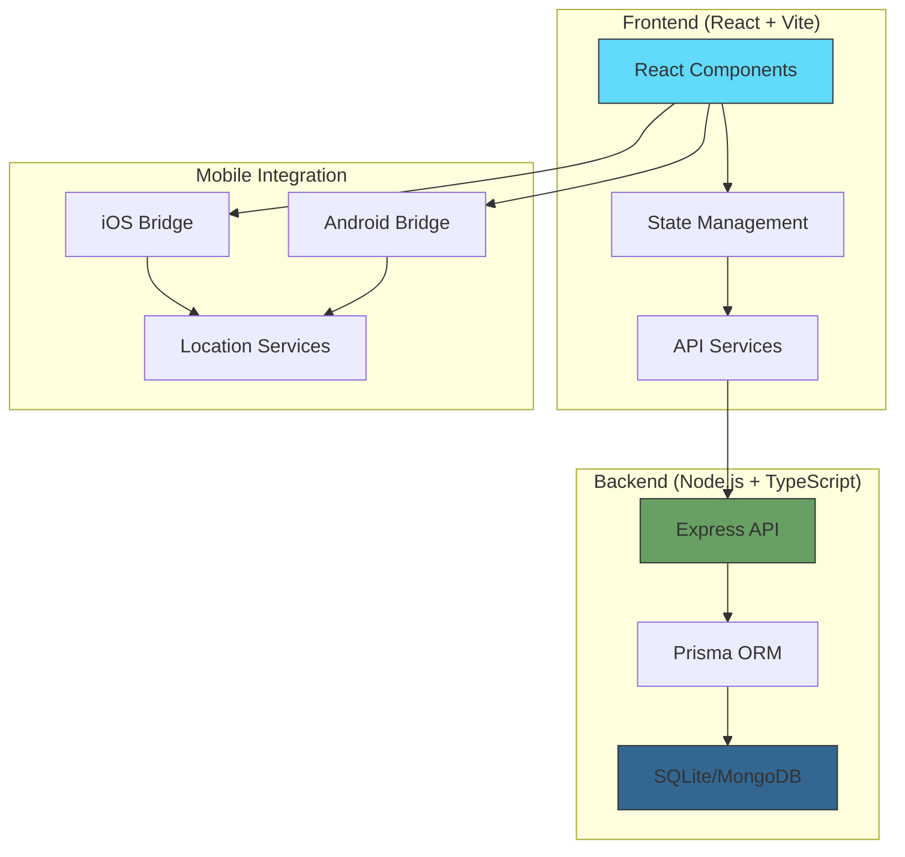

# Traveal Documentation Index

## 📚 Complete Documentation Guide

Welcome to the comprehensive documentation for the Traveal government travel data collection application. This documentation provides detailed information for developers, administrators, and stakeholders.

### 📋 Documentation Overview

| Document | Purpose | Audience |
|----------|---------|----------|
| [API Documentation](./API.md) | Backend API endpoints and schemas | Developers, Integrators |
| [Component Documentation](./COMPONENTS.md) | Frontend React components | Frontend Developers |
| [Database Documentation](./DATABASE.md) | Database schema and operations | Backend Developers, DBAs |
| [Deployment Guide](./DEPLOYMENT.md) | Setup and deployment procedures | DevOps, System Administrators |
| [Testing Guide](./TESTING.md) | Testing strategies and workflows | QA Engineers, Developers |
| [Privacy & Security](./PRIVACY.md) | Privacy protection and security measures | Security Teams, Compliance |

### 🚀 Quick Start

1. **New Developers**: Start with [Deployment Guide](./DEPLOYMENT.md) → [Component Documentation](./COMPONENTS.md)
2. **API Integration**: See [API Documentation](./API.md) → [Database Documentation](./DATABASE.md)
3. **Testing Setup**: Follow [Testing Guide](./TESTING.md)
4. **Security Review**: Check [Privacy & Security](./PRIVACY.md)

### 🏗️ Architecture Overview

### 📱 Technology Stack

#### Frontend
- **React 18**: Modern React with hooks and functional components
- **Vite**: Fast development server and build tool
- **Tailwind CSS**: Utility-first CSS framework
- **React Router**: Client-side routing

#### Backend
- **Node.js 18+**: JavaScript runtime
- **TypeScript**: Type-safe development
- **Express.js**: Web application framework
- **Prisma**: Type-safe database ORM

#### Database
- **SQLite**: Development database
- **MongoDB**: Production database
- **Prisma Schema**: Database modeling

#### Mobile
- **Swift**: iOS native bridge
- **Kotlin**: Android native bridge
- **WebView**: Hybrid app integration

### 🛡️ Security & Privacy

- **GDPR Compliant**: Full European privacy regulation compliance
- **Anonymous Data**: No personal identifiers stored
- **Encryption**: AES-256 encryption for sensitive data
- **JWT Authentication**: Secure token-based authentication
- **Rate Limiting**: API protection against abuse

### 🧪 Testing Strategy

- **Unit Tests**: Jest + React Testing Library
- **Integration Tests**: Supertest for API testing
- **E2E Tests**: Cypress for user workflows
- **Coverage**: 80%+ test coverage goal

### 📊 Project Status

- ✅ **Frontend**: Complete React application with onboarding
- ✅ **Backend**: Full API with authentication and trip management
- ✅ **Database**: Prisma schema with SQLite/MongoDB support
- ✅ **Mobile**: iOS and Android native bridges
- ✅ **Testing**: Comprehensive testing setup
- ✅ **Documentation**: Complete technical documentation

### 🤝 Contributing

1. **Read Documentation**: Start with relevant docs above
2. **Development Setup**: Follow [Deployment Guide](./DEPLOYMENT.md)
3. **Testing**: Run tests per [Testing Guide](./TESTING.md)
4. **Security**: Review [Privacy & Security](./PRIVACY.md)
5. **Code Review**: Submit PR with documentation updates

### 📞 Support

- **Technical Issues**: Create GitHub issue
- **API Questions**: See [API Documentation](./API.md)
- **Security Concerns**: Review [Privacy & Security](./PRIVACY.md)
- **Deployment Help**: Check [Deployment Guide](./DEPLOYMENT.md)

---

**Built with ❤️ for sustainable transportation research in Kerala**